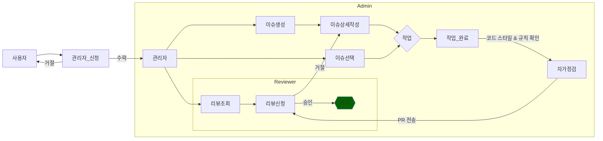

# Contributing

# 기여 지침
프로젝트 기여하는 것에 관심을 가져주셔서 감사합니다.
우리는 버그 보고서, 새로운 기능, 수정, 추가 문서 등 우리는 커뮤니티의 피드백에 답하는 것을 중요하게 생각합니다.

## 이슈 요청
- <버그> 요청 사항이 있을 경우 이슈의 버그 탬플릿을 참고하여 작성해주세요
- <기능> 요청 사항이 있을 경우 이슈의 기능 탬플릿을 참고하여 작성해주세요
- <그외> 요청 사항이 있을 경우 이슈의 해당하는 탬플릿을 참고하여 작성해주세요
 
## PR 요청
- 배포 버전의 경우 ```main``` 브렌치에 있으며 ```dev``` 에서 대부분의 작업중인 코드들을 PR 하고 있습니다.
- project를 확인하여 진행중인 사항과 담당자를 체크후 원하는 작업을 진행 하여 중복되는 일이 없게 진행할 수 있습니다.
- 중요한 작업의 경우 이슈에 커뮤니티를 열러 모든이와 공유 하여 주세요
- PR이 너무 크면 안됩니다. 검토가 어려움으로 작은 PR로 변경 사항을 제출하여 주는것이 좋습니다.

## PR 순서도
  1. 원하는코드를 ```fork``` 한다
  2. 원하는 작업에 담당자 등록을 하여 코딩을 진행한다
  3. 코딩 스타일 가이드를 고려하며 작업한다
  4. ```commit template``` 을 참고하여 명확한 커밋을 작성한다
  5. 작업이 완료되고 [PR 요청 체크 리스트](#PR-요청-체크-리스트)를 참고하여 작업을 완료한다.
  6. PR 자동화 보고에 CI 가 실패하더라도 리뷰어와 대화를 통하여 문제점을 해결해 나간다.

# PR 요청 체크 리스트
Pull Request 전에는 꼭 확인하여 올려주시기 바랍니다.
- [ ] [코드 행동 강령](#.github/CODE_OF_CONDUCT.md)을 준수하는가.
- [ ] [GPG 인증](#GPG-인증)를 완료한 유져인지 
- [ ] [코딩 스타일](#코딩-스타일)를 준수 하였는지 확인하세요
- [ ] [단위 테스트](#단위-테스트)를 완료 했는지 확인하세요

## 코드 제출

## GPG 인증
### 사용자 커밋이 인증이 되어있는 사용자인지 확인하싶시오
- 주소 : [Github Doc GPG](https://docs.github.com/en/authentication/managing-commit-signature-verification/signing-commits)
- mac : [GPGtools](https://gpgtools.org/) !주의 safari에서만 다운가능
- window : [gnupg](https://www.gnupg.org/)

## 코딩 스타일
- [구글 스타일 가이드](https://google.github.io/styleguide/jsguide.html) 확인해보기
- 자바스크립트
  ```js
  function TabSize()
  {
    console.log("1. 2칸으로한다");
    console.log("2. 스페이스보단 tab으로 작업한다");
  }
  ```
- 타입스크립트
  ```ts
  interface I_prop{
    name: string;
    age: number;
  }

  type T_prop = {
    name: string;
    age: number;
  } 
  ```
- 마크타운
  ```markdown
  # 의경우 링크를 이용하여 이동하기 쉽게 설계
    ex) [목차 이동](#밑에-목차-이동)
    # 밑에 목차 이동
  ```
 
##  테스트
- [ ] 병합 혹은 충돌이 없는 상태인지 확인한다.
- [ ] 코드 스타일이 맞는지 확인한다.
- [ ] 로컬 환경에서 확인 가능한 부분 확인한다.
- [ ] 질문이 있을경우 커뮤니티에 질문을 올려 상담을 한다.
- [ ] 커밋로그가 정리가 되었는지 확인한다.